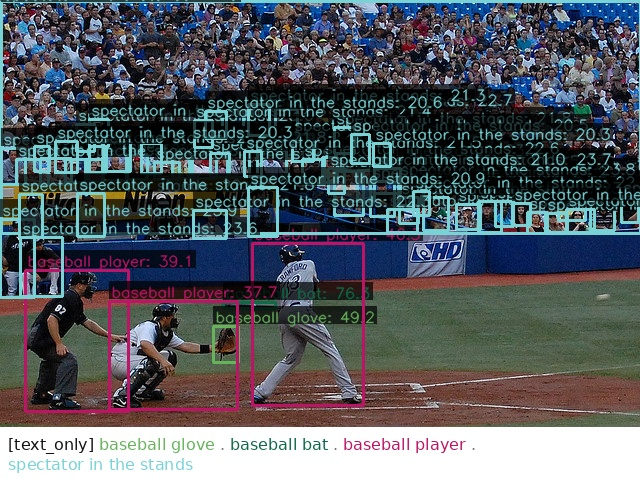
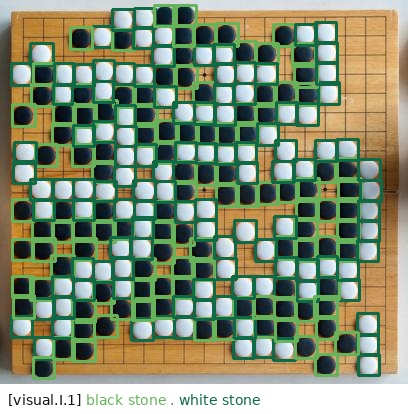
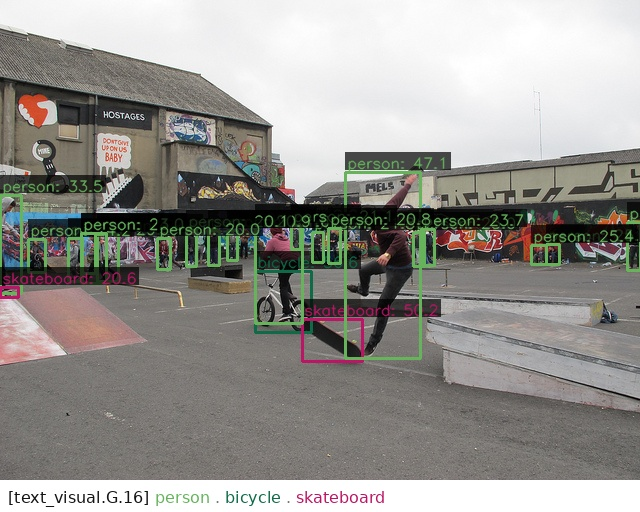

<div align="center">

# OPUS: A Simple yet Effective Unified Framework for Open-Vocabulary Detection

<a href="https://arxiv.org/abs/2608.30247"></a>
<a href="https://huggingface.co/Megvii-Algo-Team/OpusDet"></a>
<a href="LICENSE"></a>

</div>

## Introduction

**OPUS** (**O**pen-vocabulary, **P**rompt-**U**nified, **S**imple) is a unified open-vocabulary detector supporting four prompt modes in one model: **Text** (`text_only`), **Visual-I** — interactive boxes or points (`visual.I.*`), **Visual-G** — category-level visual exemplars (`visual.G.*`), and **Mixed** — text plus Visual-G (`text_visual.G.*`).

- A simple unified OVD framework with DINOv3, a prompt-aware decoder, one-stage ICA training, and SAM3 single-pass grounding data — no heavy early fusion, staged training, or iterative relabeling.
- State-of-the-art Visual-I on COCO / LVIS-minival / ODinW35 (**68.1 / 69.2 / 54.7 AP**), with strong Text and Visual-G in the same model.
- Mixed prompting that consistently outperforms text-only or visual-only alone.

## Model Zoo

<table>
  <thead>
    <tr>
      <th rowspan="2">Model</th>
      <th rowspan="2">Input</th>
      <th colspan="3">Visual-I</th>
      <th colspan="3">Visual-G</th>
      <th colspan="3">Text</th>
      <th colspan="2">Mixed</th>
      <th rowspan="2">Download</th>
    </tr>
    <tr>
      <th>COCO</th>
      <th>LVIS-mv</th>
      <th>ODinW35</th>
      <th>COCO</th>
      <th>LVIS-mv</th>
      <th>ODinW35</th>
      <th>COCO</th>
      <th>LVIS-mv</th>
      <th>ODinW35</th>
      <th>COCO</th>
      <th>LVIS-mv</th>
    </tr>
  </thead>
  <tbody>
    <tr>
      <td><a href="configs/opus_dinov3_convnext-b/opus_dinov3_convnext-b_text_visual_pretrain_all.py">OPUS (ConvNeXt-B)</a></td>
      <td>640×640</td>
      <td><b>68.1</b></td>
      <td><b>69.2</b></td>
      <td><b>54.7</b></td>
      <td>43.4</td>
      <td>38.6</td>
      <td>25.9</td>
      <td>49.6</td>
      <td>43.0</td>
      <td>22.1</td>
      <td>49.9</td>
      <td>45.2</td>
      <td><a href="https://huggingface.co/Megvii-Algo-Team/OpusDet">🤗 Weights</a></td>
    </tr>
  </tbody>
</table>

## Install

Recommended: **Python 3.10**, **PyTorch 2.7**, **CUDA 12.6**.

**Requirements**

| Package | Version |
|---------|---------|
| PyTorch | 2.7.0 |
| torchvision | 0.22.0 |
| transformers | 5.5.0 |
| huggingface_hub | 1.24.0 |
| mmcv | **v2.2.0** (submodule) |
| mmengine | **v0.11.0rc2** (submodule) |
| mmdet | **v3.3.0** (submodule) |
| lvis-api | **0.5.3** (submodule commit `031ac21`) |

```bash
pip install torch==2.7.0 torchvision==0.22.0 --index-url https://download.pytorch.org/whl/cu126
pip install -e third_party/mmcv -v
pip install -e third_party/mmengine -v
pip install -e third_party/mmdetection -v
pip install -e third_party/lvis-api
pip install -r requirements.txt
```

## Demo

[`tools/demo.py`](tools/demo.py) — four prompt modes. Visual-G / Mixed need category embeddings from [`tools/gen_visual_prompts.py`](tools/gen_visual_prompts.py), which accepts **COCO-format** annotation JSON (`images` / `annotations` / `categories`; OD / VG also supported). Example with COCO 2017 train:

```bash
CKPT=work_dirs/<checkpoint>.pth
CFG=configs/opus_dinov3_convnext-b/opus_dinov3_convnext-b_pretrain_o365.py
PKL=work_dirs/visual_prompts/<ckpt_subdir>/preds/instances_train2017.pkl
```

**Text**

```bash
PYTHONPATH="$(pwd):${PYTHONPATH:-}" python tools/demo.py image assets/000000000544.jpg \
  --model "$CFG" --weights "$CKPT" \
  --texts "baseball glove . baseball bat . baseball player . spectator in the stands" \
  --mode text_only
```

<p align="center"></p>

**Visual-I** (interactive box prompts)

```bash
PYTHONPATH="$(pwd):${PYTHONPATH:-}" python tools/demo.py image assets/7212.jpg \
  --model "$CFG" --weights "$CKPT" \
  --texts "black stone . white stone" \
  --mode visual.I.1 \
  --visual-prompts '[{"category":"black stone","bbox":[274,297,298,320]},{"category":"white stone","bbox":[273,338,296,359]}]' \
  --no-draw-label --score-thr 0.15
```

<p align="center"></p>

**Visual-G** — generate embeddings from COCO train (once per checkpoint):

```bash
PYTHONPATH="$(pwd):${PYTHONPATH:-}" python tools/gen_visual_prompts.py \
  --input-json-path data/coco/annotations/instances_train2017.json \
  --data-prefix data/coco/train2017 \
  --sample-num-limit 32 --batch-size 16 \
  --mode visual.I \
  --model "$CFG" --weights "$CKPT" \
  --out-dir work_dirs

PYTHONPATH="$(pwd):${PYTHONPATH:-}" python tools/demo.py image assets/000000087038.jpg \
  --model "$CFG" --weights "$CKPT" \
  --texts "person . bicycle . skateboard" \
  --mode visual.G.16 \
  --prompt-path "$PKL" \
  --score-thr 0.1
```

**Mixed** (text + Visual-G; same PKL as above):

```bash
PYTHONPATH="$(pwd):${PYTHONPATH:-}" python tools/demo.py image assets/000000087038.jpg \
  --model "$CFG" --weights "$CKPT" \
  --texts "person . bicycle . skateboard" \
  --mode text_visual.G.16 \
  --prompt-path "$PKL" \
```

<p align="center"></p>

## Data Prepare

See [dataset_prepare.md](dataset_prepare.md) for full instructions (Objects365, GoldG, COCO, LVIS, ODinW, etc.).

Default data root: `data/`, or set:

```bash
export ROOT_DATA_DIR=/path/to/datasets
```

## Train

```bash
bash playground/train_opus_dinov3_convnext-b.sh
```

## Eval

```bash
bash playground/test_opus_dinov3_convnext-b.sh
```

Set `CHECKPOINT=...` to override the default checkpoint. The script runs COCO / LVIS-mini / ODinW35 with modes `visual.I.1`, `visual.G.16`, `text_only`, and `text_visual.G.16`.

**Speed benchmark** (wall-clock via `opus.utils.speed_profiler`):

```bash
PRODUCT=opus_dinov3_convnext-b BMK=coco MODE="text_only visual.I.1" IMAGE_SIZE=640 \
  bash -c 'source playground/test_common.sh && speed_test'
```

## Citation

If you find OPUS useful, please cite:

```bibtex
@article{opus2026,
  title   = {OPUS: A Simple yet Effective Unified Framework for Open-Vocabulary Detection},
  author  = {Wei, Xiaoyan and Yao, Zhimin and Yang, Ruilin and Zhang, Wei and Dai, Yong and Zhang, Yi and Ge, Wei},
  journal = {arXiv preprint arXiv:2608.30247},
  year    = {2026}
}
```

## Acknowledgement

We build upon and are inspired by:

- [OpenMMLab](https://github.com/open-mmlab) ([MMDetection](https://github.com/open-mmlab/mmdetection), [MMCV](https://github.com/open-mmlab/mmcv), [MMEngine](https://github.com/open-mmlab/mmengine))
- [DINOv3](https://huggingface.co/facebook/dinov3-convnext-base-pretrain-lvd1689m), [CLIP](https://huggingface.co/openai/clip-vit-base-patch32)
- [T-Rex2](https://github.com/IDEA-Research/T-Rex)

Documentation and test scripts were assisted by AI coding tools (e.g. [Cursor](https://cursor.com)).

## License

This project is released under the [Apache License 2.0](LICENSE). Third-party components and their licenses are listed in [NOTICE](NOTICE).
